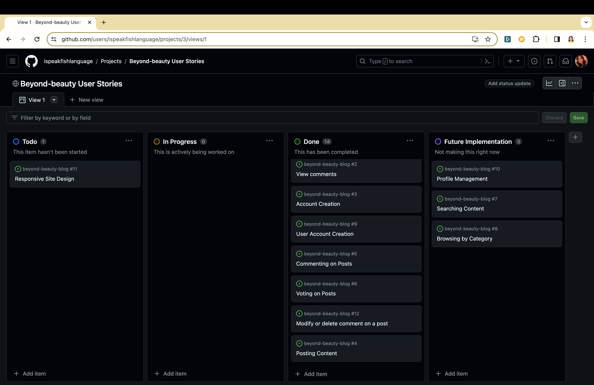
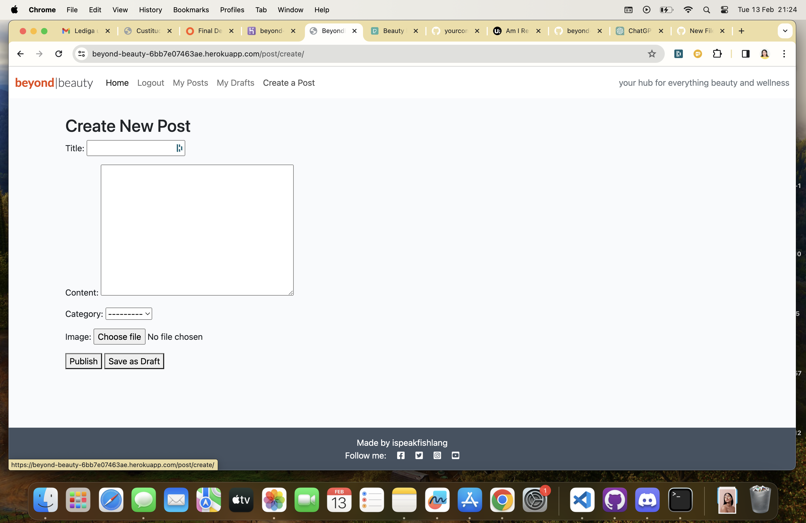
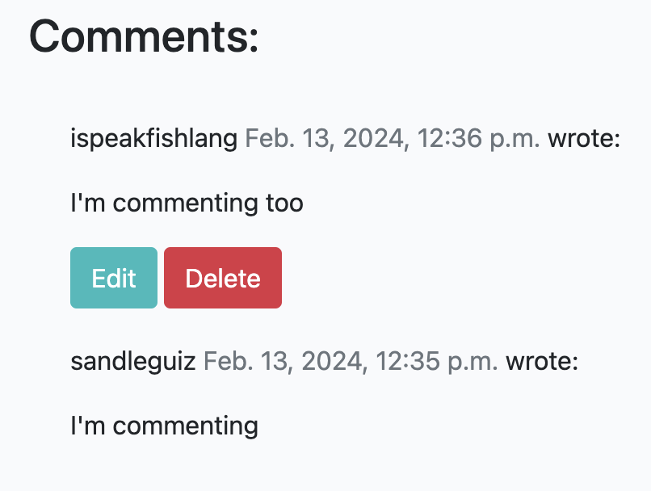
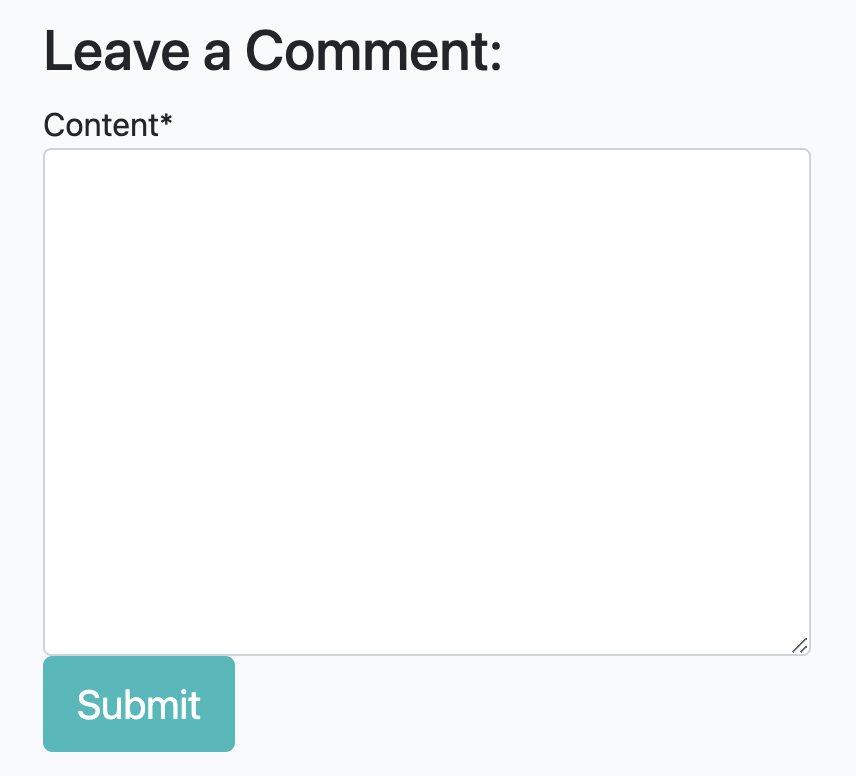
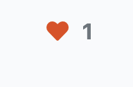
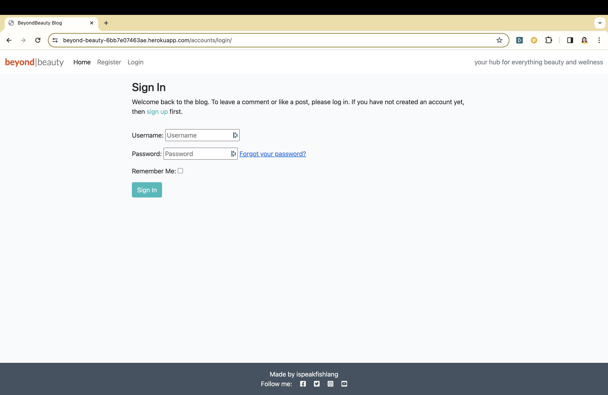
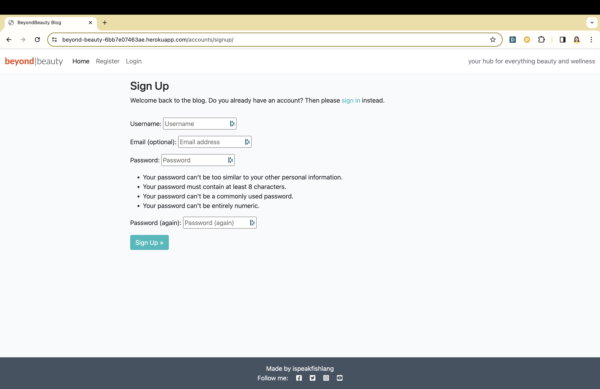
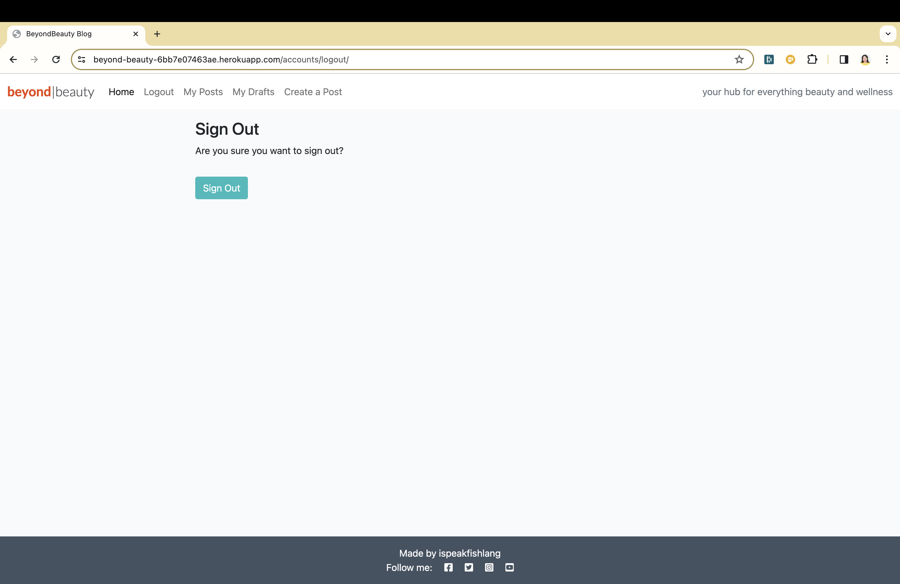

# Beyond Beauty Blog

Beyond Beauty Blog is a dynamic platform dedicated to beauty enthusiasts, offering a space for members to share their experiences, tips, and insights into the beauty world. The blog features member profiles, allowing users to express themselves through detailed biographies, share posts, and interact with the community through comments and likes.

## Live Site

Explore Beyond Beauty Blog: [Live Site](https://beyond-beauty-6bb7e07463ae.herokuapp.com/)


## Table of Contents

- [User Experience Design (UX)](#user-experience-design-ux)
  - [The Strategy Plane](#the-strategy-plane)
    - [Site Goals](#site-goals)
    - [Agile Planning](#agile-planning)
      - [Epics](#epics)
      - [User Stories](#user-stories)
  - [The Scope Plane](#the-scope-plane)
  - [The Structure Plane](#the-structure-plane)
    - [Features](#features)
    - [Future Features](#future-features)
  - [The Skeleton Plane](#the-skeleton-plane)
    - [Wireframes](#wireframes)
    - [Database Design](#database-design)
    - [Security](#security)
  - [The Surface Plane](#the-surface-plane)
    - [Design](#design)
      - [Colour Scheme](#colour-scheme)
      - [Typography](#typography)
      - [Imagery](#imagery)
- [Technologies](#technologies)
- [Testing](#testing)
- [Deployment](#deployment)
  - [Version Control](#version-control)
  - [Heroku Deployment](#heroku-deployment)
- [Credits](#credits)
  - [Content](#content)
  - [Acknowledgements](#acknowledgements)

# User Experience Design (UX)

## The Strategy Plane

### Site Goals

Beyond Beauty aims to foster a vibrant community where beauty aficionados can connect, share, and discover beauty trends, routines, and tips. The blog seeks to empower its members by providing a platform to showcase their unique beauty journeys and insights.

### Agile Planning

Developed with agile methodologies, Beyond Beauty progressed through incremental updates, focusing on delivering value at every stage. The project spanned 3 sprints, prioritizing foundational features before moving on to enhance user experience and design.

A detailed Kanban board facilitated task management, visible [here](https://github.com/users/ispeakfishlanguage/projects/3/views/1).



#### Epics

- **EPIC 1 - Base Setup:** Establishing the foundational structure for the application.
- **EPIC 2 - Authentication:** Implementing a secure system for user registration and login.
- **EPIC 3 - "Member" Options:** Enabling users to create, manage, and display content created by themselves when logged in.
- **EPIC 4 - "Home Page":** Designing the main landing page to show all content and options for logged in members.
- **EPIC 5 - Deployment:** Launching the application on Heroku for public access.
- **EPIC 6 - Documentation:** Compiling comprehensive documentation and guides for the application.

#### User Stories

User stories were crafted for each epic, focusing on delivering specific functionalities that align with the overall project goals. From the base setup to deployment and documentation, user stories guided the development process, ensuring a user-centered approach.
- **EPIC 1 - Base Setup:**
  - Developer: Establish base.html layout for easy reuse across pages.
  - Developer: Develop static resources for functional images, CSS, and JavaScript.
  - Developer: Configure project for seamless integration of core features.
  - Developer: Design footer with social media links and contact info.
  - Developer: Implement navbar for easy website navigation on all devices.

- **EPIC 2 - Authentication:**
  - Site User: Ability to register a new account.
  - Site User: Ability to sign in if I already have an account on the blog.
  - Site User: See likes, comments and when the post was created.
  - Site User: See a paginated and neat landing page.

- **EPIC 3 - "Member" Options:**
  - Site User: Create new posts.
  - Site User: Edit or Delete posts created by me.
  - Site User: Like a post.
  - Site User: Comment on posts.
  - Site User: Edit or Delete comments created by me.

- **EPIC 4 - "Home Page":**
  - Site User: See a post.
  - Site User: See the comments on a post.
  - Site User: Navigate the blog easily.
  - Developer: Add a navigation bar to make navigation simple.
  - Developer: Add thumbnails to display the image featured in the post.
    
- **EPIC 5 - Deployment:**
  - Developer: Early deployment to ensure functionality.
  - Developer: Deploy project to Heroku to make it accessible online.
  - Developer: Ensure the project contains the correct settings, for example DEBUG = False, when deploying.
 
    
## The Scope Plane

Beyond Beauty is designed as a fully functional blog platform, offering extensive features for interaction and content management, backed by a responsive design for accessibility on any device.

## The Structure Plane

### Features

- **Navigation Menu:** A user-friendly interface for seamless site exploration.


The Navigation contains links for Home, Posts, Drafts, Log In, Log Out and has allauth options.

The following navigation items are available.

  * Home -> index.html - View All posts ordered by the creation date
    * Create a Post -> create_post.html - Visible after Registration. 
    * My Posts -> user_posts.html - Visible after registration. List of published post by the logged in user.
    * My Drafts -> user_posts.html - Visible after registration. List of drafts the loggen in user has saved.
  * Login -> login.html - Visible to users that are logged out.
  * Register -> signup.html - Visible to users that are logged out. 
  * Logout -> logout.html - Visible to logged in users.
  
- **Responsive Design:** Ensuring an optimal viewing experience across various devices.

  

  
- **Member Options:** Allowing users to create personalized posts to share their beauty journey, as well as edit or delete their existing content. Registered users can also vote on posts they like and leave comments.

  

  

  
  
- **Interactive Elements:** Like buttons and comment sections to engage the community.

  

  

- **Footer**

A footer has been added to the bottom of the site, this contains links to social media so that users can follow the project and the creator on social media


- **Sign in Page** 



- **Register Account**



- **Log Out confirmation page**



### Future Features

- **Expanded User Interaction:** Introducing search functionality and user profiles for enhanced community engagement.
- **Personalized Content Recommendations:** Tailoring content suggestions based on user preferences and interactions, navigate by categories to only see one type of content selected by the site user.

## The Skeleton Plane

### Wireframes

Wireframes were utilized to conceptualize the site layout and user flow, ensuring an intuitive and efficient user experience.

### Database Design

A relational database schema supports the blog's content management and user interaction, with a focus on scalability and security.

### Security

Security measures are implemented to protect user data and ensure a safe community space, adhering to best practices and compliance standards.

## The Surface Plane

### Design

- **Colour Scheme:** A simple yet elegant palette that doesn't overwhelm the site user and instead let the images be the main visual.
- **Typography:** Carefully selected fonts to enhance readability and aesthetic appeal.
- **Imagery:** High-quality images that resonate with the blog's beauty theme, complementing the content and engaging users.

## Technologies

Beyond Beauty utilizes a range of technologies, including HTML, CSS, JavaScript for front-end development, and Python Django for the back-end, ensuring a robust and scalable application.

- HTML
The structure of the Website was developed using HTML as the main language.
- CSS
The Website was styled using custom CSS in an external file.
- JavaScript
JavaScript was used to make the Site Pagination.
- Python
Python was the main programming language used for the application using the Django Framework.
- Visual Studio Code
The website was developed using Visual Studio Code IDE.
- GitHub
Source code is hosted on GitHub.
- Git
Used to commit and push code during the development of the Website.
- Font Awesome
This was used for various icons throughout the site.
- Balsamiq
Wireframes were created using balsamiq from [https://balsamiq.com/wireframes/desktop/#].
- Heroku
The application is hosted on [Heroku](https://beyond-beauty-6bb7e07463ae.herokuapp.com/)

**Python Modules Used**

* Django Class and def function based views (Post List, Post Detail, Comments, Likes, Draft List, own posts Post List.
* Allauth - was used to integrate a set of Django applications addressing authentication, registration and account authentication.
* Alert Messages - Login, Log Out to ensure that the user understands what actions have taken place.

**External Python Modules**

asgiref==3.7.2

bleach==6.1.0

blinker==1.6.3

cachetools==5.3.1

certifi==2023.7.22

cffi==1.16.0

charset-normalizer==3.3.0

click==8.1.7

cloudinary==1.37.0

colorama==0.4.6

coverage==7.3.2

cryptography==41.0.7

defusedxml==0.7.1

dj-database-url==0.5.0

dj3-cloudinary-storage==0.0.6

Django==4.1

django-allauth==0.59.0

django-crispy-forms==1.14.0

django-environ==0.11.2

django-summernote==0.8.20.0

django-taggit==5.0.1

Flask==2.3.0

Flask-SQLAlchemy==2.5.1

google-auth==2.23.2

google-auth-oauthlib==1.1.0

greenlet==3.0.1

gspread==5.11.3

gunicorn==20.1.0

httplib2==0.22.0

idna==3.4

itsdangerous==2.1.2

Jinja2==3.1.2

lolcat==1.4

MarkupSafe==2.1.3

oauth2client==4.1.3

oauthlib==3.2.2

packaging==23.2

psycopg2==2.9.9

psycopg2-binary==2.9.9

pyasn1==0.5.0

pyasn1-modules==0.3.0

pycparser==2.21

pyfiglet==1.0.2

PyJWT==2.8.0

pyparsing==3.1.1

python3-openid==3.2.0

pytz==2023.3.post1

requests==2.31.0

requests-oauthlib==1.3.1

rsa==4.9

setuptools==69.0.3

six==1.16.0

SQLAlchemy==1.4.46

sqlparse==0.4.4

tzdata==2023.3

urllib3==1.26.15

webencodings==0.5.1

Werkzeug==3.0.1

## Testing

Comprehensive testing strategies cover functionality, usability, and performance, ensuring a reliable and user-friendly platform. Check TEST.md for testing information.

## Deployment

### Version Control

Git and GitHub were used for version control, facilitating collaboration and iterative development.

The following git commands were used throughout development to push code to the remote repo:

```git add <file>``` - This command was used to add the file(s) to the staging area before they are committed.

```git commit -m “commit message”``` - This command was used to commit changes to the local repository queue ready for the final step.

```git push``` - This command was used to push all committed code to the remote repository on github.

### Heroku Deployment

The blog is deployed on Heroku, making it accessible to a wide audience. The steps to deploy are as follows:

- Navigate to heroku and create an account
- Click the new button in the top right corner
- Select create new app
- Enter app name
- Select region and click create app
- Click the resources tab and search for Heroku Postgres
- Select hobby dev and continue
- Go to the settings tab and then click reveal config vars
- Add the following config vars:
  - SECRET_KEY: (Your secret key)
  - DATABASE_URL: (This should already exist with add on of postgres)
  - EMAIL_HOST_USER: (email address)
  - EMAIL_HOST_PASS: (email app password)
  - CLOUNDINARY_URL: (cloudinary api url)
- Click the deploy tab
- Scroll down to Connect to GitHub and sign in / authorize when prompted
- In the search box, find the repositoy you want to deploy and click connect
- Scroll down to Manual deploy and choose the main branch
- Click deploy

The app should now be deployed.

The live link can be found here: [Live Site](https://beyond-beauty-6bb7e07463ae.herokuapp.com/)


## Credits

### Content

The theme is taken from CODESTAR Blog by Code Institute.
The post model is based on the one from CODESTAR Blog, but modified for this project.

### Acknowledgements

Special thanks to:
- Daniel Ahlberg for helping me with everything I needed help with at home while making this project
- Lucas Alenbro for troubleshooting my code with me and really coming up with possible solutions, and not giving up.
- Daisy McGirr for being the most awesome mentor I've ever had and making time to mentor me when necessary.
- “I think therefore I blog” walkthrough: Provided initial steps for setting up & deploying the site.  
- "I think therefore I blog" + "Hello Django" + Slack + Stackoverflow helped in the creation of the totality.
